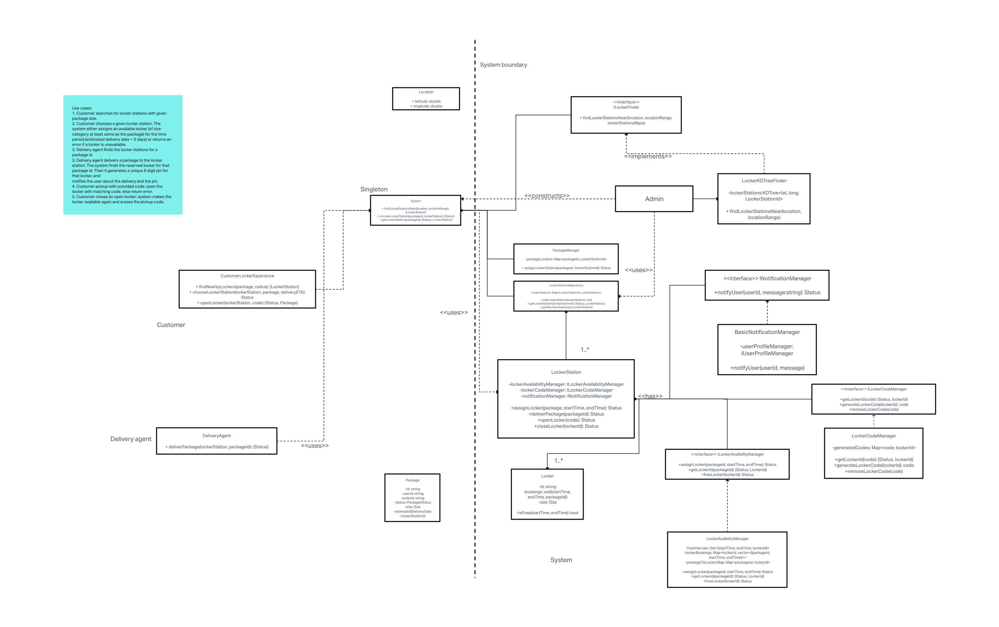

# LLD: Amazon Locker System

This repository provides an object-oriented design for an Amazon Locker System implemented in C++. The system allows customers to securely store and retrieve their packages from self-service lockers. The implementation is not thread-safe and does not include any form of persistence, but the interfaces allow the system to be easily extended to support these features.

## Class Diagram

The class diagram above represents the initial design of the system. Please note that it was somewhat modified during the implementation phase to better reflect the requirements of the system.

## Functional Requirements

- Customer searches for locker stations with given package size.

- Customer chooses a given locker station. The system either assigns an available locker (of size category at least same as the package) for the time period (estimated delivery date + 3 days) or returns an error if a locker is unavailable.

- Delivery agent finds the locker stations for a package id

- Delivery agent delivers a package to the locker station. The system finds the reserved locker for that package id. Then it generates a unique 6 digit pin for that locker, and notifies the user about the delivery and the pin.

- Customer pickup with provided code: open the locker with matching code, else return error.

- Customer closes an open locker: system makes the locker available again and erases the pickup code.

## Getting Started

To get started with the Amazon Locker System, follow these steps:

1. Clone the repository: `git clone https://github.com/your-username/amazon-locker-system.git`
2. Change directory: `cd amazon-locker-system`
3. Build the project: `make all [DEBUG=1]`
3. Run the program: `./locker_system`
4. `main.cpp` contains the main function that demonstrates a sample run of the system, feel free to modify it to test different scenarios.

## License

This project is licensed under the [MIT License](LICENSE).